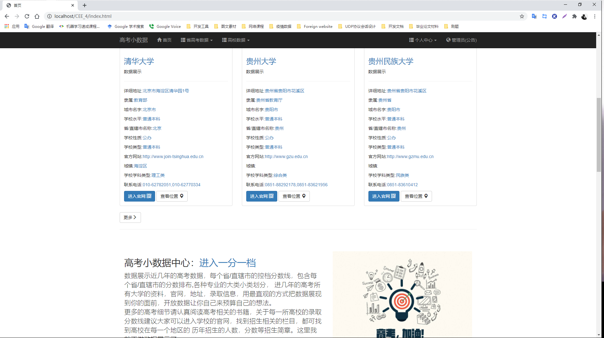

# CEE_4

## 介绍

这是一个基于第四版开发的高考小数据统计的小项目，实现简单，重点在sql的执行地方是一个很难的，项目可以查询中国老
历年来的高考的很多数据信息，主要有高考相关的某个省/直辖市的历年高考控档分数线和一分一档的高考分数和人数分布
，值得大家关心的大学专业介绍，是相当完整的介绍，从本科到专科，各种各样的专业介绍，专业必修课程，就业方向，就业
岗位等专业相关的介绍。其次就是相关的高校的信息，每一个地区的高校录取，共2700多所学校的，包含的学校的基本信息，
地理位置、高校开放的专业介绍、高校的院校情况，这是相当不错的地方。

随着飞速发展的互联网信息，伴随着教育的需求方向，高考在我们的国家有着悠久的历史，也是大部分人的人生转折点。高校小数据系统，就是一个帮助大家能够更好，更快的获取报考志愿材料的系统，存放着进5年每一个省/直辖市的高考历年投档线，联系两年的高考一份一档的，1000多种专业名词相关的介绍，还有全国1000多所院校的信息，院校的开设专业，院校的开设学院，系统提供给用户注册功能，用户可以根据自己喜欢的专业和学校收藏起来，方便下一次的登录查看。采用的是可分离模块的设计思想，使用Java Web的Tomcat容器和Servlet和JSP技术等相关技术实现。
- (1)、省控分数线查询：选择地区和省/直辖市，可以查找到过去5年的省控分数线，文科本科一批、文科本科二批、理科本科一批、理科本科二批、高职专科的分数线。条形分布图表示出历年的文理科的一批二批的分数线，直观的显示出来历年的变化。
- (2)、一分一档查询：选择地区和省/直辖市，可以查找历经2年的省/直辖市的一分一档人数的变法。采用动态的条形图，更加的方便的查询当前分数中当年累计的人数和人数。方便学生预测自己的分数排名。更好的规划高考志愿。
- (3)、专业中心：按照专业的本科和非本科专业，在按照专业大类分专业小类，在专业小类的下面的专业分布。查询专业的相关介绍，相关的专业介绍含有专业的课程，就业方向，就业的岗位分布，岗位的详细介绍。
- (4)、高校大全：查询地区下面的省/直辖市，选择城市和学校类型。查找到学校的相关信息，可以查看学校的详细信息，学校的开始专业，开设院校和收藏学校到个人收藏中。
- (5)、用户中心：用户的注册和用户的登录，展示用户的收藏的专业和收藏的学校。将用户的信息缓存到客服端。
- (6)、公告模块：展示当前的系统的公告和维护信息。

## 功能模块设计

(1)、查询控档分数线功能分析：
- ①查询地区
- ②查询省/直辖市
- ③查询历年控档分数线
- ④展示柱形图
(2)、查询一分一档功能分析：
- ①查询地区
- ②查询省/直辖市
- ③查询历年控档分数线
- ④可视化展示一分一档，
(3)、查询专业功能分析：
- ①查询本科或非本科
- ②查询专业大类
- ③查询专业小类
- ④查询专业详情
- ⑤收藏专业
(4)、查询高校功能分析：
- ①查询地区
- ②查询城市
- ③查询学校类型
- ④查询学校形详情
(5)、用户功能分析：
- ①用户注册
- ②用户登录
- ③用户退出
- ④用户查询收藏
- ⑤用户移除收藏

## 软件架构

我使用的是Spring-jdbc和c3p0的连接池技术，其他的都是简单的Servlet和jsp技术，没有使用太多的，前端用的框架
主要有Bootstrap框架和 ECharts框架和jQuery框架。

- 1、com.shaoyuayu.dao 包中主要是定模块的DAO 程序的接口 (interface),表示可以提供哪些服务接口，如: BatchsDao、CareerDao、CareerDetailDao、CollectDao、LocalDao、MailDao、PsDao、SchoolDetailDao、SchoolInfoDao和UserDao
- 2、com.shaoyuayu.dao.impl 包中主要是个Dao 接口的实现类(class)，用来具体实现对数据库的增删改查相关的操作，如：BatchsDaoImpl、CareerDaoImpl、CareerDetailDaoImpl、CollectDaoImpl、LocalDaoIpml、 MailDaoImpl、 PsDaoImpl、 SchoolDetailDaoImpl、 SchoolInfoDaoImpl、UserDaoImpl等。
- 3、com.shaoyuayu.entity 包中定义实体类对象JavaBean 类。如Batchs、Career、Local、Ps、SchoolInfo、Token、User
- 4、com.wlxy.dyms.model包中定义的是各类对象的JavaBean类。如Admin、GBranch、Student、Teacher等。
- 5、com.shaoyuayu.service 包中主要是service 接口对象(interface)，表示可以提供的服务接口，如: BatchChartService、BatchsService、 CareerDetailService、CareerService、CollectService、LocalService.java LoginService、MailService、Pservice、RegisterSaveService、 SchoolDetailService、SchoolInfoService等服务接口。
- 6、com.shaoyuayu.service.impl 包中是service的实现类(class),主要有BatchChartServiceImpl、 BatchsServiceImpl、CareerDetailServiceImpl、 CareerServiceImpl、CollectServiceImpl、LocalServiceImpl、 LonginServiceIpml、MailServiceImpl、RegisterSaveServiceImpl、 SchoolDetailServiceImpl、SchoolInfoServiceImpl等实现类。
- 7  com.shaoyuayu.util 包中主要含有系统常用的工具类(class),如：CareerDetailUtil、CareersUtil、CollectUtil、DateUtil、 DESUtil、DataSourceUtil(数据源)、LocalUtil、MailUtil、ProvinceUtil、PsUtil等系统用到的工具类。
- 8、com.shaoyuayu.web.servlet 包中定义web的servlet查询，接受用户请求，调用service接口和Util工具，实现请求和响应，转发和重定向到对于的jsp和请求地址中。如：CareerServlet、CareersServlet、IndexServlet、ProvinceServlet、SchoolAcademyServlet、SchoolCareersServlet、 SchoolItemServlet、 SchoolsServlet、StairScoreServlet等Servlet程序。
- 9、com.shaoyuayu.web.servlet.user 包中定义的是处理用户登录、收藏、注册和发送验证码请求的Servlet程序。如：CollectServlet、 LoginSaveServlet、LoginServlet、LogInToServlet、RegisterSaveServlet、RegisterServlet、RegisterToServlet 的Servlet程序。
- 10、com.shaoyuayu.web.servlet.json 包中主要处理前端需要的JSON数据请求有StairScoreJsonServlet 、SchoolJsonServlet等Servlet程序。
- 11、WebRoot文件夹中主要包含images文件夹、js文件夹、WEB-INF文件夹、css文件夹、json文件夹和大量的JSP页面。css、js和fonts主要放置Bootstrap框架先关的样式、脚本和资源外，还有自定义的样式、脚本和静态资源。Json文件夹下面存放当前项目需要的json静态资源。Web-inf文件夹下面是web.xml配置文件外，还有资源文件夹lib和项目输出路径classes

## 项目的流程

### 第一阶段：

网络数据采集和数据库初始建设，开始是最重要的明白自己想要那些数据不能盲目在网络中使用爬虫，因为我写的爬虫不是智能分析的。参照自己要爬取的数据建立好初期的数据库，讲爬虫爬取到的数据储存在数据库中，刚开始我使用的是单线程爬虫，这样虽然在理想的状态下有着很好的数据准确性，但是一天下来完成的任务太少了，而且网络也会影响到爬虫程序，后来我采用线程池完成爬虫，使用节点和日志的记录方式记录爬虫的日志，这样即便在网络不稳定的情况下，下次任务的起点是一个确定的地方。在数据库连接池的地方我采用的是阿里云的Druid数据库连接池技术配上Spring JDBC，虽然很好的解决单线程资源问题和网络问题，但是新的问题又出现了，就是数据库设计的时候我们设计数据库锁机制，导致数据在插入的时候由于id相同而导致插入数据库线程异常。线程的异常开始的时候直接就中断当前的线程。后来我采用数据库的触发器和事假对插入进行新的数据。我把线程出错以后结束，采用异常捕捉到以后将当前的线程休眠。等待网络爬取到资源的时候再唤醒线程去对网络资源解析和插入数据库。
### 第二阶段：

数据的清洗，这部分我实在数据库里面完成的，因为爬虫是在不同的网络地址中爬取到数据，数据有很多的重复的，不同的地址爬取到的数据都存在相互的缺陷，需要通过数据库对数据进行合并和清除重复的数据，在选择数据的时候，我使用的是java调用进行过程化的选择和比较。为清洗过的数据建立一个新的关系结构。
### 第三阶段：

在数据设计完成的基础上，把见面和对于的功能进行分析，选择前端采用的框架，最后我选择前端使用的框架是Bootstrap3.4和ECharts，因为后台使用的是jsp技术。Bootstrap作为前端能够满足我需要的响应式。更好的支持移动端的显示。选择Echarts是我对有些数据的展示必须是可视化的，这样才能直观的观察到数据对比。
### 第四阶段：

功能具体分析，把功能更加的详细分解，才能更快的开发出来自己想要的程序。选择后台技术，肯定的是JavaWeb 开发。开发环境的选择，JDK8和Tomcat8刚好配合我的MySQL8，最终的一部分是数据库连接池，我采用的是和爬虫相同的技术阿里云Druid连接池技术加上Spring JDBC配合使用。
第五阶段：程序功能分析和实现，按照功能分析，我需要自己写好前端的页面，怎样的布局和设计，前端采用简洁的方式，最原生的Bootstrap。没有写入过多的样式和脚本。因为没有开发文档和专业的分析和对Bootstrap的和Echarts深入的了解，只是停留在入门阶段，所有很多的页面复写的次数超过5、6次，当加入JSP的时候这样做好逻辑交互。在写不同的模块的时候都改动过已有的前端见面。在写入用户登录注册发送验证码的时候，存在异步交互，过滤器对交互中的请求过滤处理和ajax的安全设cookie的设置存在很大的逻辑问题。开始发送验证码的时候我使用当前线程发送验证码发送验证码，造成前端的响应超时问题，后来采用启动线程发送验证码，打印日志。重构地区表，因为除了请求的时候get后面带上汉字是很难处理的，还有做请求查询高校，一分一档的时候没有获取到参数，怎么样决策使用那个地区和省/直辖市的问题。然后重构地区表。拦截器的设置和URL路径的设置，JSP中应用的样式文件和脚本和资源。在拦截器中会出现300的错误，也就是重定向过多了。关于异常的页面处理，日志处理。拦截器记录请求的日志打印。

## 总结

通过本次的程序设计，提高个人的学习能力和问题处理能力。了解Java Web 开发中很多细节的设计和常见错误。从大二上的半个学期过后，项目的阶段1到最后在远程的阿里云部署，经历很多的问题。都是在基础的理论出发找到问题所在。在保存的时候，我采用的是关系型数据库保存数据，同时也值得我在后期探索分布式爬虫和非关系数据库的开发鉴定基础。

## 开发环境

1. jdk8.X
2. Tomcat 8.0.X
3. Spring-jdbc 5.X
4. javaEE 4.0

## 项目展示

首页

## 项目作者

邮箱：shaoyayu0419@qq.com,yayushao@gmali.com

